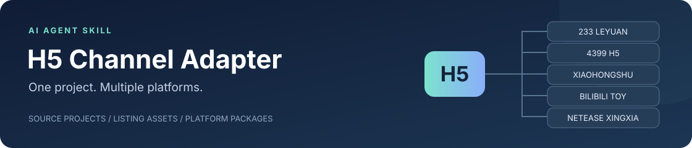
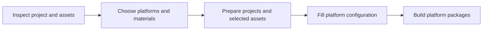

# H5 Channel Adapter



**Take your TapTap H5 game to more platforms. Start once, choose what to adapt.**

This Skill gives AI Agents platform integration rules, listing-material guidance and packaging workflows. Point it at your project, choose platforms and materials, and let the agent carry out the code changes, image preparation and builds.

[简体中文](README.zh-CN.md) · [Quick start](#quick-start) · [Platforms](#platforms) · [Workflow](#workflow) · [Contribute](#contribute)

## What it handles

- **Independent projects** — create a directory or branch per platform, preserving the source game and existing saves.
- **Listing materials** — prepare copy, icons, covers and screenshots to platform requirements; choose video work separately.
- **Guided setup** — finish credential-independent work first, then ask for the missing AppID, permissions or assets.
- **Package budgets** — identify large assets, offer optimization or reduction plans, and update menus, settings and playback after your choice.
- **Channel updates** — bring main-project changes into existing platform projects while keeping their integrations.

## Platforms

| Platform | Adaptation scope |
| --- | --- |
|  **233 Leyuan H5** | H5 packaging, rewarded ads and listing copy/images |
|  **4399 H5 minigames** | H5 packaging, AppID, ads, cloud saves and optional leaderboards |
|  **Xiaohongshu MiniTool** | Offline H5 adaptation, permissions, compact ZIP and listing fields |
|  **Bilibili TOY** | Static H5 builds, TOY SDK integration, covers and icons |
|  **NetEase Xingxia** | Existing-game import, SDK integration, copy/images and optional promotional media |

> The actual scope depends on platform capabilities, application permissions and project compatibility. The agent checks current requirements before adapting your game.

## Quick start

### 1. Install the Skill

For Codex, clone into your `skills` directory. The repository is currently private; your GitHub account needs access.

**macOS / Linux — zsh / bash**

```bash
git clone https://github.com/xxxzzzfff2020/h5-channel-adapter.git "${CODEX_HOME:-$HOME/.codex}/skills/h5-channel-adapter"
```

**Windows — PowerShell**

```powershell
$skillBase = if ($env:CODEX_HOME) { $env:CODEX_HOME } else { Join-Path $env:USERPROFILE '.codex' }
git clone https://github.com/xxxzzzfff2020/h5-channel-adapter.git (Join-Path $skillBase 'skills/h5-channel-adapter')
```

For other agents supporting `SKILL.md`, use their Skill installation method. One installation serves both languages. If the directory exists, inspect local changes first; clean Git installations can update with `git pull --ff-only` from the Skill directory.

### 2. Prepare source and materials

Keep source code, build instructions, TapTap listing copy and existing images in the main project folder. Preserve your existing folder structure. Include a current game ZIP if available.

**Video is optional.** Provide promotional footage and gameplay recordings when you want video production or reuse. Keep account secrets in secure local configuration, outside source, listing assets and release packages.

### 3. Ask your agent

Get guided platform and material selection:

```text
Use $h5-channel-adapter for <absolute project path>.
Guide me through choosing platforms and listing materials, then prepare
independent projects and packages. List any platform setup inputs still needed.
```

Or specify the scope directly:

```text
Use $h5-channel-adapter to adapt <absolute project path> for 4399 and Bilibili TOY.
Copy and screenshots are in the project folder. Process images and copy only;
do not produce or inspect videos this time.
```

## Choose your materials

| Scope | Work included | FFmpeg needed? |
| --- | --- | --- |
| **Images and copy** | Text, icons, covers, screenshots and specification checks | No |
| **Images, copy and video** | Also capture, edit, combine and inspect video | Enabled when needed |
| **Projects only** | Code adaptation, platform configuration and packaging; defer listing materials | No |

The agent asks at the start and reuses an explicit answer. **When video is not selected, it does not install or invoke FFmpeg / ffprobe.** If a platform requires a video, it is listed as pending while image and project work continues.

When selected, 233/4399 videos combine promotional content with real gameplay. Skipping listing-video production does not remove in-game music or video; package-size reductions require their own selected plan.

## Workflow



1. **Prepare locally first** — complete work that does not require account credentials.
2. **Progress per platform** — waiting for an ID or permission on one platform does not hold up the others.
3. **Choose reductions before applying them** — review size and impact, select a plan, then check the rebuilt package.
4. **Get files and next steps** — receive source, game packages, materials and remaining inputs; resume when configuration arrives.

## Requirements

| Environment | Details |
| --- | --- |
| **Operating systems** | macOS / Windows; commands and platform tools follow the current OS |
| **Base helpers** | Python 3.9+ standard library for inventory, image specifications and package budgets |
| **Video tools · optional** | [FFmpeg](https://ffmpeg.org/) / ffprobe when video work is selected; audio transcoding is also enabled only when requested |
| **Image production** | Uses the agent's available image tools; image dimension checks do not require FFmpeg |
| **Android target** | Xiaomi 8 / Android 10 by default, configurable per project; host-engine constraints are checked separately |

Official platform Skills, CLI tools and MCP integrations stay independent and are checked for updates when used. See [environment setup](references/portability.md) and [official-tool integration](references/upstream-tools.md).

## Repository layout

```text
h5-channel-adapter/
├── SKILL.md            # Agent entry point
├── references/         # Platform integration, workflows and field mappings
├── assets/             # Shared rules, manifest examples and documentation artwork
├── scripts/            # Inventory, image specifications, material and package checks
└── tests/              # FFmpeg-free checks and optional video tests
```

## Contribute

Contribute a platform, update listing specifications, improve adaptation guidance or fix macOS / Windows compatibility through an issue or pull request.

[Contribution guide](CONTRIBUTING.md) · [Report an issue or propose a platform](https://github.com/xxxzzzfff2020/h5-channel-adapter/issues/new/choose) · [Changelog](CHANGELOG.md)

The repository remains private while preparing for public release. An open-source license will be selected before that release.

<sub>Platform icons come from their official sites and identify the respective platforms. [Artwork sources](assets/branding/README.md)</sub>
