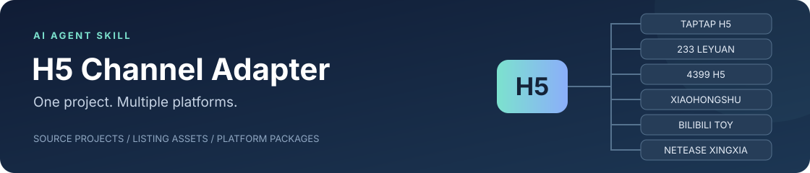

# H5 Channel Adapter



**把本地 H5 游戏适配到 TapTap 和更多平台，一次发起，按需适配。**

这个 Skill 为 AI Agent 提供各渠道的接入规则、物料处理指引与出包流程。给出项目目录，确认来源类型，挑好目标平台、各平台功能和物料，代码调整、图片适配与打包由 Agent 接着完成。

[English](README.md) · [快速上手](#快速上手) · [支持平台](#支持平台) · [工作流程](#工作流程) · [参与贡献](#参与贡献)

## 解决的问题

把单平台 H5 搬到其他平台时，重复工作很多：

- **工程隔离**：为每个平台建立独立目录或分支，保留主项目源码和已有存档。
- **物料适配**：按后台规格准备文案、图标、封面和截图；宣传视频按需选择制作。
- **引导补全**：先完成不依赖后台凭证的部分，缺 AppID、权限或素材时集中提示。
- **体积管控**：定位包体大头，提供压缩或删减方案；选择后同步处理菜单、设置和播放逻辑。
- **多渠道同步**：主版本更新后，将变化同步到各平台工程，保留渠道接入配置。

## 支持平台

| 平台 | 适配能力与范围 |
| --- | --- |
| **TapTap H5** | 新接入或增量维护；按选项处理广告、身份、存档、榜单、分享和诊断，未核实 H5 能力保持待定 |
|  **233 乐园 H5** | H5 打包、激励广告、上架图文物料 |
|  **4399 H5 小游戏** | H5 打包、AppID 配置、广告、云存档、可选排行榜 |
|  **小红书小工具** | 离线 H5 适配、权限配置、小体积 ZIP 与后台字段 |
|  **B 站 TOY** | 静态 H5 构建、TOY SDK 接入、封面与图标 |
|  **网易星匣** | 已有游戏导入、SDK 接入、图文与可选宣传媒体 |

> 平台能力、应用开通状态和项目兼容情况决定实际接入范围。Agent 会在适配前核对当前要求。

## 快速上手

### 1. 安装 Skill

在 Codex 中，将公开仓库克隆到 `skills` 目录，无需申请仓库访问权限。

**macOS / Linux（zsh / bash）**

```bash
git clone https://github.com/xxxzzzfff2020/h5-channel-adapter.git "${CODEX_HOME:-$HOME/.codex}/skills/h5-channel-adapter"
```

**Windows（PowerShell）**

```powershell
$skillBase = if ($env:CODEX_HOME) { $env:CODEX_HOME } else { Join-Path $env:USERPROFILE '.codex' }
git clone https://github.com/xxxzzzfff2020/h5-channel-adapter.git (Join-Path $skillBase 'skills/h5-channel-adapter')
```

其他支持 `SKILL.md` 的 Agent，按其安装方式载入本仓库。中英文共用一次安装。已有同名目录时先检查本地修改；干净的 Git 安装可在 Skill 目录运行 `git pull --ff-only` 更新。

工作室项目可固定已验证的发布标签；以后按需更新 Skill，已交付的游戏包不会自动变化。这个仓库提供执行规则和检查工具，具体 SDK 接入与代码改造仍由 Agent 在游戏工程里完成。

### 2. 准备源码与物料

把源码、构建说明、已有上架文案和已有图片放进项目主目录。保留原文件夹结构即可；有现成游戏 ZIP 也可以一起放入。

**视频是可选输入。** 准备制作或复用宣传视频时，再提供已有宣传片和实录。账号密钥放在本地安全配置中，不混入源码、物料或发布包。

### 3. 唤起 Agent

让它引导你选择平台和物料：

```text
使用 $h5-channel-adapter，项目在 <项目绝对路径>。
请先引导我选择目标平台和要处理的物料，再生成独立工程与平台包，
最后列出需要我在后台补充的参数。
```

也可以一次说明范围：

```text
使用 $h5-channel-adapter，把 <项目绝对路径> 适配到 4399 和 B 站 TOY。
文案和截图都在主工程里。本次只处理图文，不制作或检查视频。
```

## 来源与功能按需选择

来源可为普通 H5、TapTap H5 或其他平台 H5；TapTap → TapTap 属于增量维护，Maker Lua 不属于此转换范围。每个平台分别选择功能，不默认全加，保护已有机制和存档。

[选择流程](references/zh-CN/selection.md)在游戏交付目录保存 `source.kind`、目标和功能状态：`not_selected`、`pending_verification`、`unsupported`、`configured`。单选弹窗不能伪称复选框；无原生多选时使用编号多选与明确汇总确认。缺回答只做只读盘点。

平台功能与离线、签到、音乐、音效、字号／设置等游戏逻辑分别选择。[可靠性配方](references/zh-CN/h5-reliability.md)覆盖存储失败、切号、云冲突、奖励事务、榜单竞态及设备音频，不承诺通用代码已实现。

**TapTap 接入顺序：**后台建好应用后，先接所选非广告功能并生成本地首包；逐包经 Owner 确认上传、设置后台横竖屏后，再通过 MCP 核验并接广告。禁止为了接广告而发布应用。完整步骤及可转交开发对话的工单见[两阶段流程](references/zh-CN/taptap.md#两阶段接入与发布边界)。

## 物料按需选择

| 本次要做什么 | 处理内容 | 需要 FFmpeg？ |
| --- | --- | --- |
| **图文物料** | 文案、图标、封面、截图及规格检查 | 不需要 |
| **图文＋视频** | 在图文基础上，补充实录、剪辑、拼接与视频检查 | 需要时启用 |
| **仅适配工程** | 代码适配、平台配置与出包；物料暂缓 | 不需要 |

Agent 会在开始时询问，已有明确选择就直接沿用。**视频未选择时，不安装、不调用 FFmpeg / ffprobe。** 平台若另有必需视频字段，会列为“待补视频”，图文与工程继续推进。

选择视频处理后，233、4399 的成片包含宣传内容与真实玩法操作。跳过宣传视频制作不会删除游戏内的音乐或视频；包体删减仍需单独选择方案。

## 工作流程


1. **先做本地准备**：完成不依赖账号凭证的工程适配和所选物料。
2. **各平台独立推进**：某个平台等待 ID 或权限，不影响其他平台继续出包。
3. **超限先给选择**：说明占用和预计影响，选择方案后执行，再检查最终包大小。
4. **交付路径与下一步**：给出源码、游戏包、物料及待补事项；配置补齐后继续对应平台。

正式候选包除包体预算外还要运行[游戏包静态预检](references/zh-CN/package-budget.md)，检查 ZIP 完整性、入口、静态资源和常见残留；SDK 回调与真机表现仍需在真实环境验证。

## 依赖环境

| 环境 | 说明 |
| --- | --- |
| **操作系统** | macOS / Windows；按系统选择命令与平台工具 |
| **基础脚本** | Python 3.9+，标准库即可执行资源盘点、图片规格与包体检查 |
| **视频工具 · 可选** | 选择视频处理时使用 [FFmpeg](https://ffmpeg.org/) / ffprobe；音频转码也只在明确需要时启用 |
| **图片制作** | 使用 Agent 当前可用的图像工具，图片尺寸检查不依赖 FFmpeg |
| **安卓目标** | 默认 Xiaomi 8 / Android 10，可按项目调整；另核对宿主内核 |

平台官方 Skill、CLI、MCP 独立获取，使用时检查上游更新。具体命令见[系统环境](references/zh-CN/portability.md)，更新方式见[官方工具接入](references/zh-CN/upstream-tools.md)。

## 仓库结构

```text
h5-channel-adapter/
├── SKILL.md            # Agent 执行入口
├── references/         # 平台接入、工作流程与字段映射
├── assets/             # 共用规则、清单示例与文档图像
├── scripts/            # 资源盘点、图片规格、物料与包体检查
└── tests/              # 图文无 FFmpeg 检查与可选视频测试
```

## 参与贡献

欢迎通过 Issue 或 Pull Request 补充新平台、更新物料规格、改进适配流程，或修复 macOS / Windows 兼容问题。

[贡献指南](CONTRIBUTING.zh-CN.md) · [提交问题或平台建议](https://github.com/xxxzzzfff2020/h5-channel-adapter/issues/new/choose) · [更新记录](CHANGELOG.md)

仓库现已公开，欢迎参与维护；开源许可证尚待确定。

<sub>平台图标来自各自官方站点，仅作平台标识。[图像来源](assets/branding/README.md)</sub>
